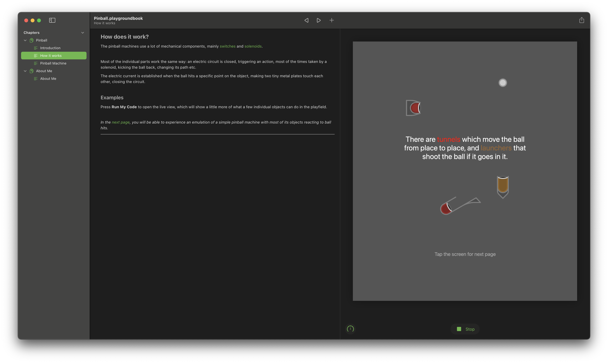
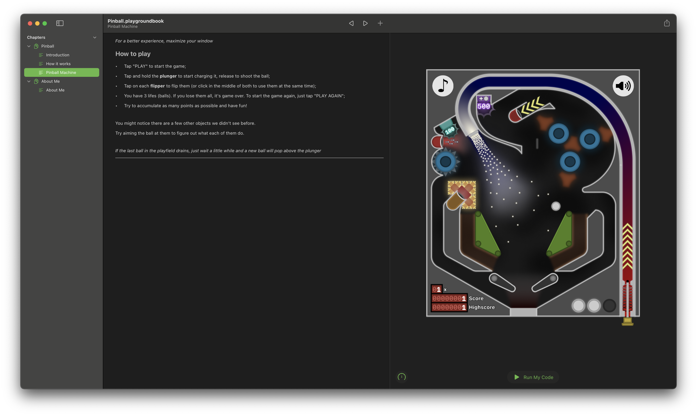
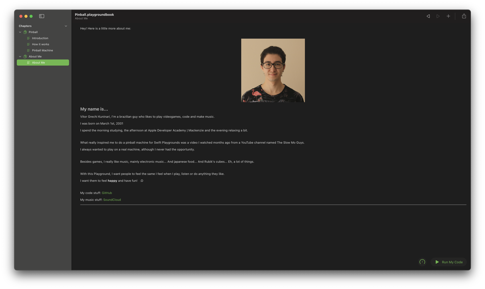

# WWDC21 Swift Student Challenge

Pinball - A simple introduction to the game and its mechanics, and a playable machine

## Introduction

The first page introduces the basic of the pinball game and the playfield.

Also, if you run the code, it will show some images of a few different pinball machines, for those who don't know how they look.

## How it works

Here is shown animations of how some pinball objects work and their behavior when the ball hit them.

## Pinball Machine

That's the main page of the playground, where the game resides.

_I dare you score a total of 50.000 points_

## About Me

In this page, I just want to share with you why I made this playground and what was the inspiration of it.

I also tell more about me and what I like to do.

